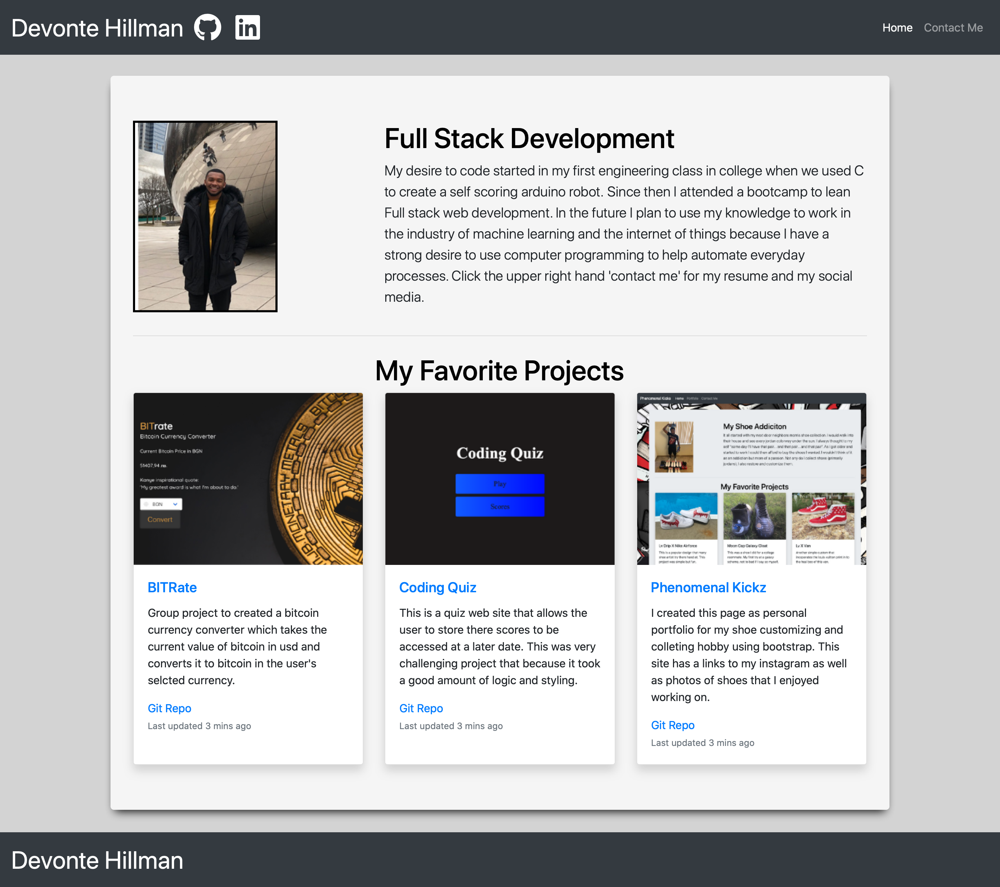

# Programing-Porfolio

## Description
Here is my profesional portfolio ([Visit the website here.](https://devontehillman.github.io/Programing-Porfolio/)) This page includes:
* Project title
* Link to the deployed version
* Link to the GitHub repository
* Screenshot of the deployed application

## Finished-Page

## What did I learn?
In this project I learned:
* How to pin Repos 
* Using a template from another project
* How to structure a technical resume
* Github profile settings
